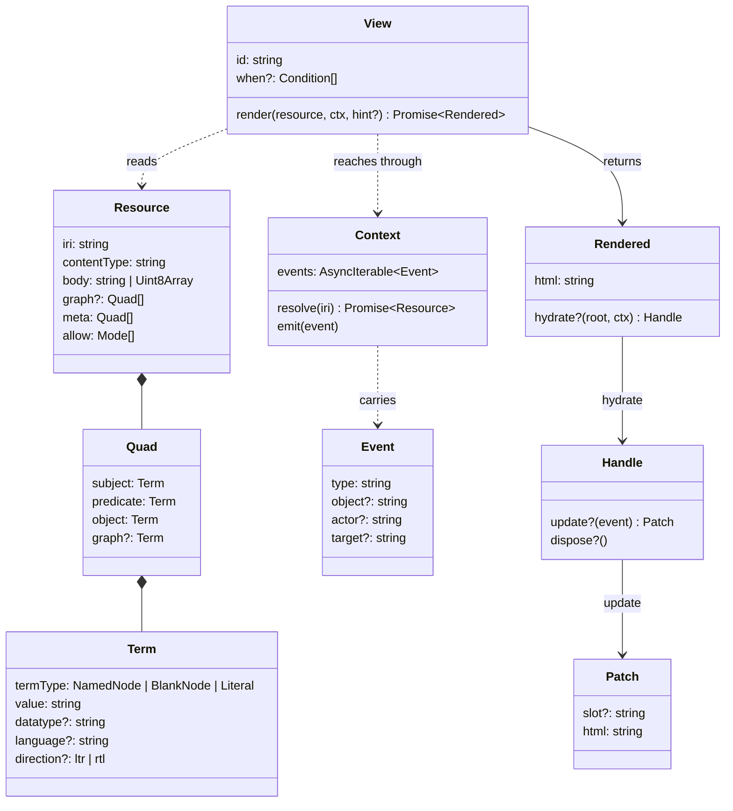

Every type here is plain data with no methods, so that a `Resource` can be
cached, serialized, or handed across an ABI boundary unchanged. That
constraint is what keeps a WASM view possible later.



## Resource

```ts
type Resource = {
  iri: string
  contentType: string
  body: string | Uint8Array
  graph?: Quad[]   // filled by a parser when the body carries RDF
  meta: Quad[]     // statements the server makes about the resource
  allow: Mode[]    // "read" | "write" | "append" | "control"
}
```

`meta` holds what the server asserts about the resource for every
requester: `rdf:type ldp:Container`, `ldp:contains`, `dcterms:modified`, the
media type as a statement. A browser host derives it from response headers
and, for a container, from the body. A server-side host has it in hand.

`allow` stays outside `meta` because it is a fact about this request and
never about the resource: the same resource answers a different `WAC-Allow`
to every agent. Inside `meta`, a cached `Resource` would carry one agent's
permissions to another.

### Quads and terms

```ts
type Quad = { subject: Term; predicate: Term; object: Term; graph?: Term }

type Term = {
  termType: 'NamedNode' | 'BlankNode' | 'Literal'
  value: string
  datatype?: string          // every Literal has one
  language?: string          // present iff datatype is rdf:langString
  direction?: 'ltr' | 'rtl'  // RDF 1.2 base direction, with language
}
```

These follow the RDF/JS shape without the prototypes. A view that wants a
store loads them into one; the core never does.

## Context

```ts
type Context = {
  resolve(iri: string): Promise<Resource>
  emit(event: Event): void
  events: AsyncIterable<Event>
}
```

`resolve` is the only way a view reaches anything beyond the resource it was
handed. The host implements it; a view never fetches. A SPARQL query is a
GET on an endpoint IRI with the query in the query string, so it goes
through `resolve` like everything else. Whether the host answers that IRI
over the network or from a store it holds in memory is the host's business.

## Event

An event is an ActivityStreams 2.0 activity as a plain object: the same
shape a Solid server's notification channels emit, so a server notification
enters the bus without translation.

```ts
type Event = {
  type: string      // an IRI; AS2 types where one fits
  object?: string   // the IRI the activity is about
  actor?: string    // the view instance that emitted it
  target?: string
  [key: string]: unknown
}
```

| Type | Meaning |
|---|---|
| `as:Update` | a resource changed |
| `as:View` | navigate to a resource, or to a fragment of the current one |
| `aleph:Select` | a view marked a resource; AS2 has no type for it |

Events carry meaning, never DOM detail. A view emits `aleph:Select`, never
`click`.

## View, Rendered, Handle, Patch

```ts
type View = {
  id: string                  // an IRI
  when?: Condition[]          // see Selection
  render(resource: Resource, ctx: Context, hint?: Hint): Promise<Rendered>
}

type Rendered = {
  html: string
  hydrate?(root: Element, ctx: Context): Handle | void
}

type Handle = {
  update?(event: Event): Patch | void
  dispose?(): void
}

type Patch = {
  slot?: string   // a data-slot value inside the view's region
  html: string    // replaces that slot, or the whole region when absent
}
```

`render` produces a string, so a view needs no DOM to exist. `hydrate` is
where a view attaches behavior after the host has placed the HTML. A view
that wants partial updates marks elements in its own HTML with `data-slot`
and patches by name.

## Hint

```ts
type Hint = {
  view?: string       // a View id
  fragment?: string   // the fragment of the requested IRI, without "#"
}
```

The host sets the hint; a view never does. `view` names how to render,
`fragment` names what within the resource to bring forward: a heading or
block in a note, a subject in an RDF document. A hint naming a view that is
not registered is ignored and the rules decide.

## Parser

```ts
type Parser = {
  contentType: string | RegExp
  parse(resource: Resource): Promise<Quad[]>
}
```

Runs before selection so that selection can look at `rdf:type`. A host
registers the parsers it wants; the core ships none, since each brings an
RDF library.
