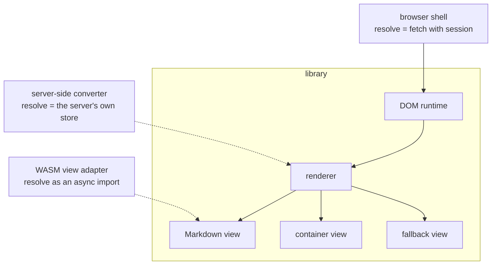
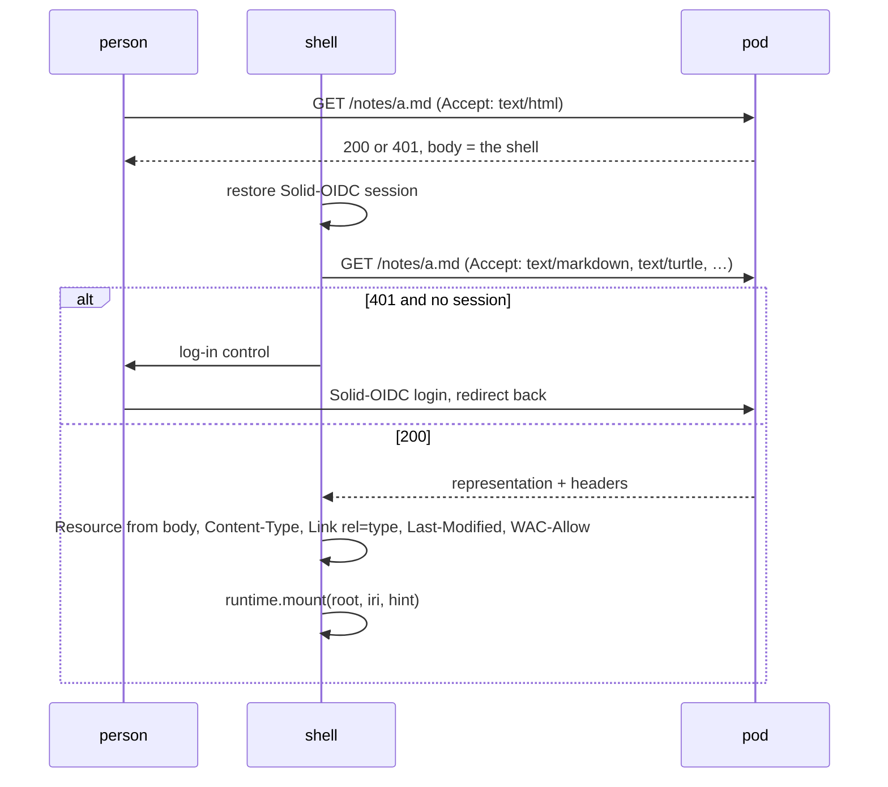

A host implements `resolve`, owns session, navigation, and layout, and calls
the runtime. Views know nothing about which host runs them.

Solid lines exist today; dotted ones are the adapters the contract is cut
for.

## The browser shell

A single HTML page with one bundle. A Community Solid Server serves it as
the `text/html` representation of every resource, including on a `401`, so
the page loads at the resource's own URL and the address bar is the
resource.

The fetch is a second request for the same resource. The slot that serves
the shell is a constant document, so it cannot carry the representation
along; a server-side host removes that round trip.

### Navigation

The shell listens for `as:View`. Another resource is a fresh `mount` into
the region; the same resource with a new fragment is a `dispatch` and no
refetch. The address follows either, and `popstate` runs the same two
branches in reverse. A `view` query parameter on the URL becomes
`hint.view`, the hash becomes `hint.fragment`.

## Server-side host

A representation converter inside the pod server calling the same
renderer. `Rendered.html` is all it needs. It can embed the representation
in the document it serves, so a shell hydrates without a second request.

## WASM views

A view implemented as a WebAssembly component: `resolve` as an async
import, `render` as an export, wrapped by an adapter that implements `View`.
Interactivity through an event stream in and patches out, which is what
`Handle.update` already is. Nothing in `Resource` has a prototype, which is
what lets it cross that boundary as data.
