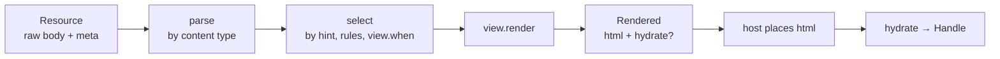

`@aleph-garden/view` turns a resource on a Solid pod into HTML. One IRI goes
in, HTML comes out, and the piece that decides how is a plain rule table over
a list of views. The first view renders Obsidian-flavored Markdown; the first
host is a browser shell that a Community Solid Server hands out as the
`text/html` representation of every resource.

This section is the public contract: the data that crosses the boundary,
the selection rule, the re-render protocol, and what a host owes the
library. Everything a view can do, it does through these.

## The pipeline



The core has no RDF library and no DOM. Parsers and views bring their own
libraries; the core knows quads only as plain data. Everything that touches
elements lives in one DOM module a browser host uses.

## What a view is

```ts
type View = {
  id: string                 // an IRI
  when?: Condition[]         // where it applies by default
  render(resource, ctx, hint?): Promise<Rendered>
}
```

A view receives a `Resource`, a `Context` to reach other resources and the
event bus, and an optional `Hint`. It returns HTML and, when it needs
behavior after placement, a `hydrate` function. That is the whole surface;
see [Contracts](/docs/view/contracts/).

## Packages

| Package | Holds |
|---|---|
| `@aleph-garden/view` | contracts, renderer, selection, DOM runtime with instance bookkeeping |
| `@aleph-garden/view-markdown` | the Markdown view |
| `@aleph-garden/shell` | the browser host |

View IRIs and the event types the library defines live under
`https://w3id.org/aleph/ns/view#`.

## What is deliberately outside

Navigation, session, editing, search and layout belong to a host. A view
never fetches, never touches the address bar, never reaches outside its own
region. The library does not model what a view is beyond the signature
above: every case arrives as a concrete view under the same contract.
