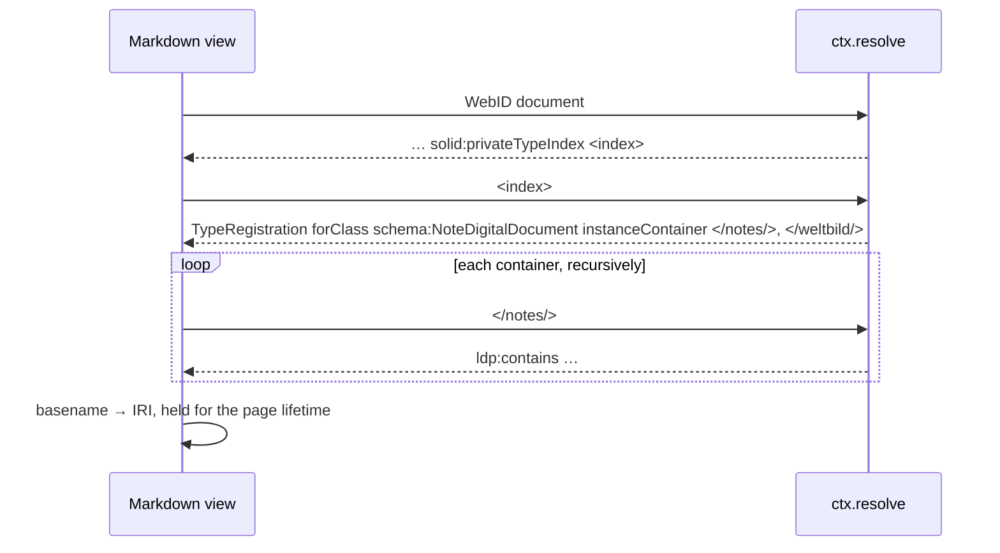

`@aleph-garden/view-markdown` renders a `text/markdown` resource the way an
Obsidian vault expects it to look. It applies by content type:

```ts
markdownView({ sparqlEndpoint, webId })
// when: [{ contentType: 'text/markdown' }]
```

## What it renders

| Syntax | Rendered as |
|---|---|
| frontmatter | a properties block; `tags`, `aliases`, `cssclasses` get their Obsidian meaning |
| `[[Name]]`, `[[Name\|Alias]]`, `[[Name#Heading]]`, `[[Name#^block]]` | `<a class="internal-link" href="…">`; unresolved ones carry `is-unresolved` and no `href` |
| `![[Note]]`, `![[image.png]]` | the note rendered inline (depth limit, cycle guard); an image as `` |
| `#tag`, `#nested/tag` | `.tag` elements |
| `- [ ]`, `- [x]` | read-only checkboxes on `.task-list-item` |
| `> [!type] Title` | `.callout` with the type on a data attribute |
| `$…$`, `$$…$$` | KaTeX, in `render` |
| ```` ```mermaid ```` | a diagram, drawn in `hydrate` since it needs a DOM |
| ```` ```sparql ```` | the query sent through `resolve` to the configured endpoint, results as a table |

The emitted DOM uses Obsidian's class names (`markdown-preview-view`,
`internal-link`, `tag`, `callout`, `task-list-item`, `metadata-container`)
and a host defines Obsidian's CSS custom properties. A vault's own CSS
snippets then apply unchanged.

## The wikilink index

Obsidian resolves `[[Name]]` by basename across the whole vault, so the
view needs a map from basename to IRI. This is the view's concern, built
through `resolve`; the host knows nothing of it. Where to look comes from
the pod, in the Solid way.



No configured roots exist: the type index already says where notes live.
An `as:Update` naming an indexed container drops the index; the next render
rebuilds it.

## Fragment

With `hint.fragment` set, the heading with that text is scrolled to and
marked `is-flashing`, as Obsidian does. Wikilinks with `#Heading` produce
hrefs with that fragment, so a click on one is an `as:View` on the same
resource and re-renders without a refetch.
