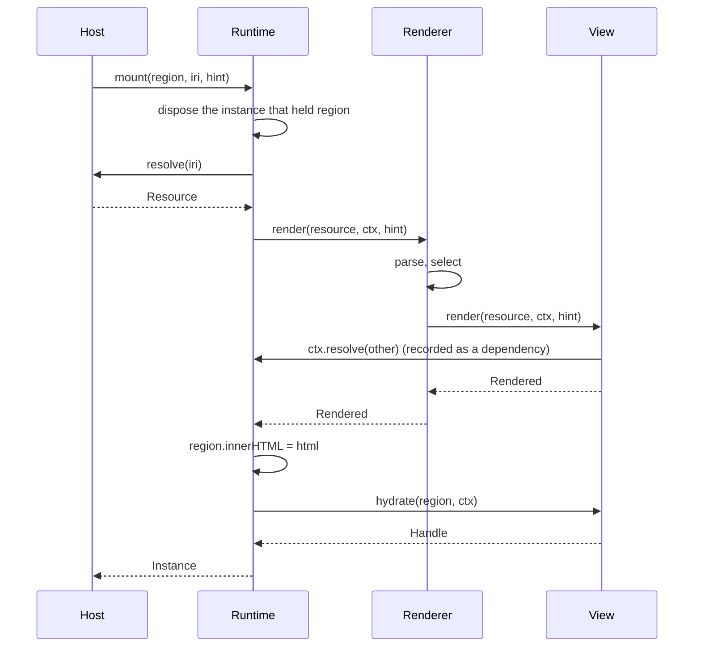
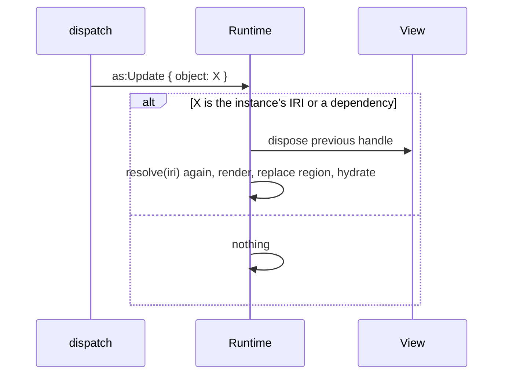
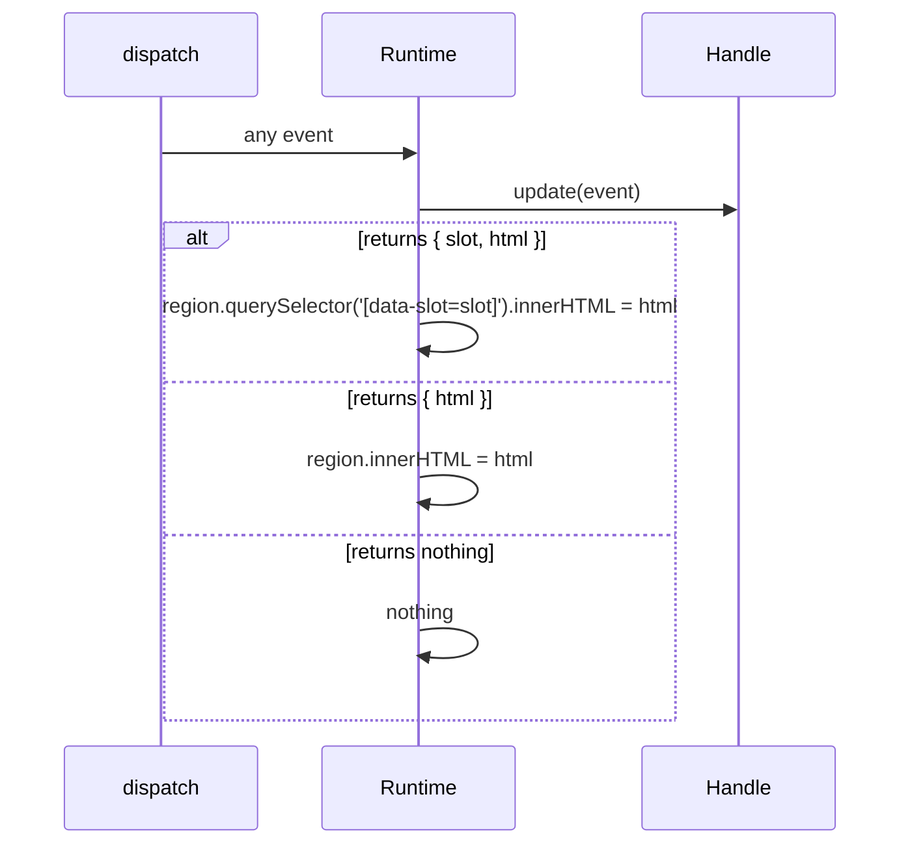
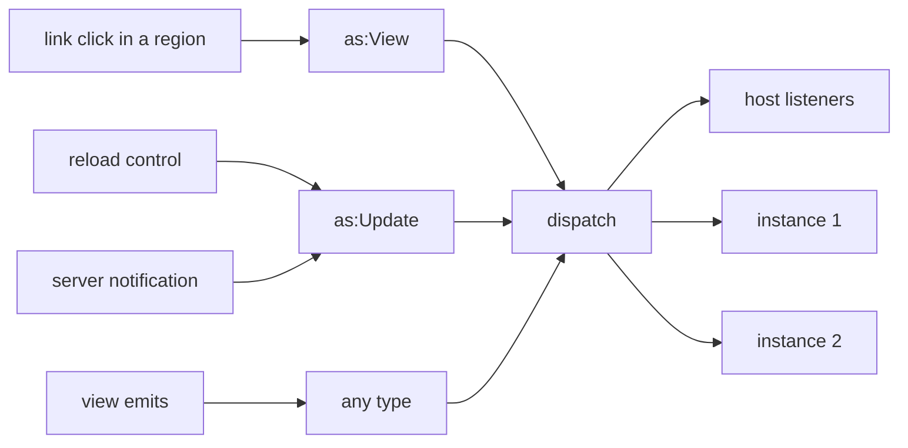

A DOM host keeps, per view instance, its region element, the handle
`hydrate` returned, and the set of IRIs the instance resolved. The core
ships this bookkeeping as a runtime, so every browser host runs the same
protocol.

```ts
type Runtime = {
  mount(region: Element, iri: string, hint?: Hint): Promise<Instance>
  dispatch(event: Event): Promise<void>
  instances(): Instance[]
  listen(listener: (event: Event) => void): () => void
}

type Instance = {
  id: string
  iri: string
  hint: Hint | undefined
  region: Element
  dependencies: ReadonlySet<string>   // IRIs resolved during the last render
  dispose(): void
}
```

## Mount



`mount` rejects when `resolve` rejects, so the host can act on a `401`.

## Two paths to a re-render

An instance is on one of two paths, decided by whether its handle has
`update`. There is no mixed case.

**Host-driven.** The `Context` given to a view instance records every IRI
that instance resolves. The host re-renders the instance whenever one of its
inputs changes: an `as:Update` naming a resolved IRI or the instance's own,
or an `as:View` on the same resource with a different view or fragment.



**Self-managed.** A handle with `update` receives every event and answers
with a `Patch` or with nothing. The host does not re-render such an instance
on its own; the instance decides.



## Every event takes the same path

`dispatch` hands an event to the host's listeners first, then to every
instance. A click in one view, a reload control, a fragment change, and
later a server notification all arrive as events and go through the same
two paths above.



Inside a region, the runtime turns a click on a same-origin link into an
`as:View` with the link's IRI as `object` and the full URL as `target`. A
view with other link semantics stops the click in its own `hydrate`.

Navigation to another resource is the host's business: it sees the
`as:View` through `listen` and calls `mount`. `dispatch` never replaces an
instance with a different resource.
