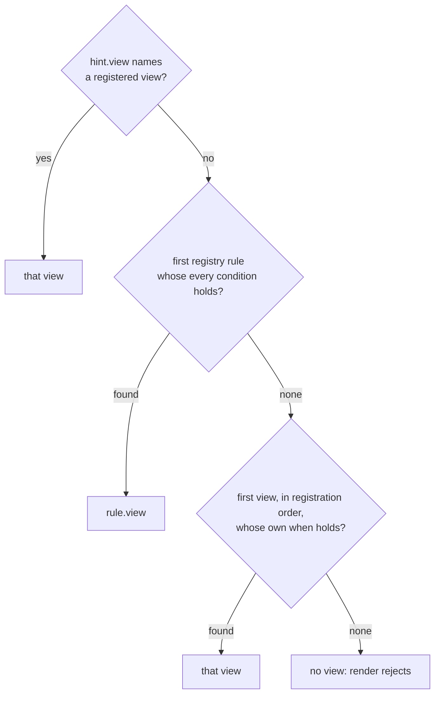

A view carries its own `when`, the conditions under which it applies by
default. The registry's rules are the user's overrides, consulted first. A
registry with no rules is the common case.

```ts
type Registry = {
  parsers: Parser[]
  views: View[]
  rules?: Rule[]   // user overrides, consulted before the views' own when
}

type Rule = {
  view: string          // a View id
  when: Condition[]     // every condition must hold
}

type Condition =
  | { contentType: string | RegExp }
  | { container: boolean }
  | { type: string }
  | { ask: string }
```

## Order



Order is explicit and nothing else decides. An empty `when` holds for
everything, which is how a fallback view is registered last.

## Conditions

| Condition | Holds when |
|---|---|
| `contentType` | the resource's media type, parameters stripped, equals the string or matches the regular expression |
| `container: true` | `meta` contains `<iri> rdf:type ldp:Container`; `false` holds when it does not |
| `type` | `graph` contains `<iri> rdf:type <type>`; never holds when `graph` is absent |
| `ask` | a SPARQL ASK over `graph` and `meta` together, evaluated by an evaluator the host registers; never holds without one |

`ask` is the condition a Fresnel lens with an instance domain becomes, where
the lens applies to resources of a certain shape, whatever their class. The
core cannot evaluate it, since it has no RDF engine.

## Why the rule list is data

The shape of a `Rule` is plain data so that the list can become a pod
resource the user edits. A view's IRI is dereferenceable for the same
reason: a description of the view can live at its IRI, and a host can load a
view by pointing at it.
